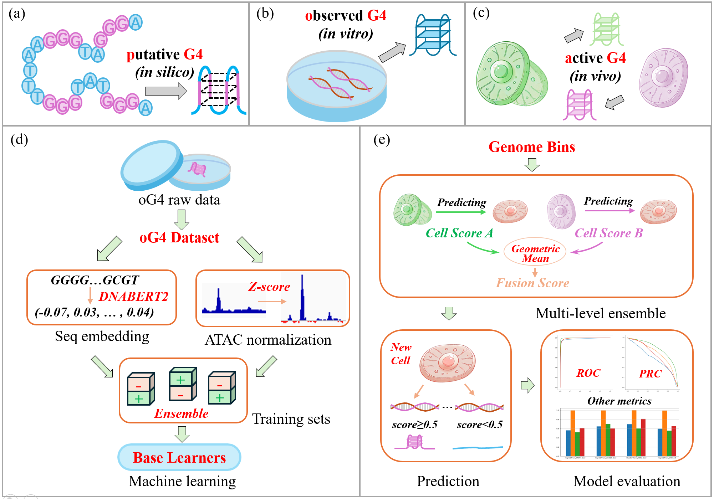

# G4Beacon2: Multi-level Ensemble for Genome-wide Prediction of Cell-Specific G-Quadruplexes Utilizing Transformed Sequences and Enhanced Chromatin Accessibility

This repository encompasses the main program for G4Beacon2, including usage instructions, the code for the data processing pipeline, and testing recommendations.

## Contents

- [1. Introduction](#1-introduction)
- [2. Requirement and installation](#2-requirement-and-installation)
- [3. Quick Start](#3-quick-start)
- [4. Sub-commands](#4-sub-commands)
- [5. Preparation before training](#5-preparation-before-training)
- [6. Training](#6-training)
- [7. Prediction](#7-prediction)
- [8. Test Data](#8-test-data)
- [9. Citation](#9-citation)


  ## Update(2024/9/29)

Previously, we introduced the beta version of [G4Beacon](https://github.com/Bocabbage/G4Beacon). After maintenance and improvements, we are delighted to introduce G4Beacon2, a genome-wide, cell-specific G4 prediction method based on multi-level ensemble learning, DNABERT2 encoding, and z-score normalization.


  ## 1. Introduction

G-quadruplexes (G4) are prevalent non-B DNA structures playing crucial biological roles in cells. Although experimental technologies for G4 identification in vitro and in vivo are advancing, computational prediction methods are increasingly preferred for their efficiency, convenience, and cost-effectiveness. However, existing tools primarily perform in vitro G4 predictions that lack cell-specific information and are often non-genome-wide, with high-performance genome-wide in vivo G4 prediction models still lacking. We present G4Beacon2, a genome-wide cell-specific G4 prediction model based on multi-level ensemble learning. G4Beacon2 leveraged DNABERT2 to capture semantic information from DNA sequences and normalized chromatin accessibility data using z-scores and established a three-level ensemble framework to achieve accurate in vivo G4 predictions across the genome. Therefore, we demonstrated the model's robust performance in both intra-cell-line and cross-cell-line tests and validated its high generalizability in cross-species predictions. Moreover, the fusion model, integrating high-quality data from multiple species and cell lines, exhibited high stability and performance. In summary, G4Beacon2 presents a novel solution for genome-wide in vivo G4 prediction by integrating multi-species and cell line data, offering a user-friendly and advanced prediction tool for researchers.




##  2. Requirements and installation
### 2.1 Requirements for G4Beacon2
If you wish to run the main functions of G4Beacon2 in default mode, you may need to meet the following configuration requirements:
- Ubuntu 20.04.4 LTS
- Bedtools 2.29.2
- Deeptools 3.5.1
- Python 3.9.7

Furthermore, if you wish to use DNABERT2 for embedding your new sequences or datasets, please refer to the [DNABERT2 documentation](https://github.com/MAGICS-LAB/DNABERT_2) for additional configuration requirements. The embedding process might take a considerable amount of time.


### 2.2 Setup environment

You can install G4Beacon2 using the following commands:
```
$ conda create -n G4Beacon2
$ conda activate G4Beacon2

$ git clone #https://github.com/FY-taott/G4Beacon2.git
$ cd G4Beacon2/
$ python setup.py install
```
If installation using git commands is unsuccessful, you can try downloading the code as a zip file, extract it locally, and then proceed with the installation.

##  3. Quick Start
G4Beacon2 provides a pre-trained default prediction model based on multi-level ensemble learning. You can directly use this framework with the following code. In this section, you will need to prepare *sequence data* and *chromatin accessibility data* as inputs. For the former, you can optionally use our provided default pre-embedded sequences (The human reference genome (hg19) and the mouse reference genome (mm10) are supported). For the latter, you can generate data by combining genome BED files provided by us with ATAC-seq p-value files.
   
    # Bed: The original BED file is required, and files for human and mouse can be found in G4Beacon2/data/GenomeBins/ .
    # Seq: The embedded sequence CSV file is required, and the pre-embedded files for human and mouse can be found in G4Beacon2/data/GenomeBins/ .
    # ATAC: The normalized ATAC-seq p-value file for the cell lines to be predicted is required(typically generated by yourself, with methods detailed in the subsequent sections). The ATAC file for the human K562 cell line can be found in G4Beacon2/data/test/ .

If you wish to predict on a new genome, encode using DNABERT2 as described in the ['5. Preparation before training'](#5-preparation-before-training) section. 

##  4. Sub-commands
A complete list of commands can be found in the help section.
```bash
g4beacon2 --help
        [g4beacon2] is an genome-wide cell specific validated G4(vG4) prediction tool.
        g4beacon2 takes seq(embedded)+atac(zscored) feature inputs.
        This software can be used to construct the feature, train on your own data or
        predict genome-wide vG4s. We provide the following sub-commands:
        
        - seqFeatureConstruct   [Takes BED-format file as input to construct sequence-feature]
        - atacFeatureConstruct  [Takes BigWig file as input to construct atac-feature]
        - getValidatedG4s       [Predicts in vivo vG4s]
        - trainingsetConstruct  [Takes your constructed-feature data and create a balanced training-set]
        - trainOwnData          [Trains GBDT model with your own data]
        
        For more details, run:
        g4beacon2 {seqFeatureConstruct, atacFeatureConstruct, getValidatedG4s, trainingsetConstruct, trainOwnData} --help
        More information: https://github.com/FY-taott/G4Beacon2
```

##  5. Preparation before training
The purpose of data preparation is to integrate multiple existing datasets to create bins for training or prediction. For subsequent training or predicting, the features obtained by the model must be input in a valid bins format; thus, this step is essential.

### 5.1 Data preparation

Step 1: Divide the raw genomic data into 2 kb windows, removing gaps and blacklist regions. Data used here can be found in G4Beacon2/data/GenomicData/ .

```bash
bedtools makewindows -g hg19_pure.chrom.sizes -w 2000         > hg19_pure_w2k.bed
bedtools intersect -a hg19_pure_w2k.bed -b gap.bed -wa -v > hg19_nogap_w2k.bed
bedtools intersect -a hg19_nogap_w2k.bed -b ENCFF001TDO_blacklist_hg19.bed -wa -v > hg19_nogap_noB_w2k.bed
```

Step 2: Merge oG4 (in vitro G4) and aG4 (in vivo G4) from different sources.

```bash
cat $file1 $file2 > file.bed
bedtools sort -i file.bed > sorted_file.bed
bedtools merge -i sorted_file.bed > $output
rm file.bed sorted_file.bed
```

Step 3: Extend the oG4 regions by 50 bp on both sides.

```bash
# extending(spell) oG4
bedtools slop -i G4seqsMG4_minus.bed \
              -g hg19.fa.fai \
              -b 50 \
              > G4seqsMG4_minus_slop50.bed

bedtools slop -i G4seqsMG4_plus.bed \
              -g hg19.fa.fai \
              -b 50 \
              > G4seqsMG4_plus_slop50.bed
```

Step4: Construct 'Gemonic Bins' based on 'the oG4 Dataset'. Besides, aG4s without oG4 data support were removed.

```bash
bedtools intersect -a hg19_nogap_noB_w2k.bed -b G4seqsMG4_plus_slop50.bed -v -wa > hg19_NOs_nonOG4_plus.bed
bedtools intersect -a hg19_nogap_noB_w2k.bed -b G4seqsMG4_minus_slop50.bed -v -wa > hg19_NOs_nonOG4_minus.bed
bedtools intersect -a hg19_NOs_nonOG4_plus.bed -b merged_ag4.bed -v -wa > hg19_NOs_negative_plus.bed
bedtools intersect -a hg19_NOs_nonOG4_minus.bed -b merged_ag4.bed -v -wa > hg19_NOs_negative_minus.bed
```

At this point, you will obtain the files G4seqsMG4_plus/minus_slop50.bed and hg19_NOs_negative_plus/minus.bed. The former represents regions with oG4 across the genome (referred to as the 'oG4 Dataset'), while the latter represents regions outside of oG4. By merging these files, you can create genome-wide 'Genome Bins.' 

ps: we recommend training on the 'oG4 Dataset' and predicting on the 'Genome Bins.'

### 5.2 Definition of positive and negative samples

an oG4 was validated as a vG4 (positive sample) if overlapping with aG4 in one specific cell line by more than 10%

```bash
bedtools intersect -a G4seqsMG4_plus_slop50.bed \
                    -b HepG2.bed \
                    -wa -F 0.1 | sort -k1,1 -k2,2n -u > plus.g4seqFirst.F0.1.bed &&

bedtools intersect -a G4seqsMG4_plus_slop50.bed \
                    -b HepG2.bed \
                    -v -F 0.1 | sort -k1,1 -k2,2n -u > plus_v.g4seqFirst.F0.1.bed &&

bedtools intersect -a G4seqsMG4_minus_slop50.bed \
                    -b HepG2.bed \
                    -wa -F 0.1 | sort -k1,1 -k2,2n -u > minus.g4seqFirst.F0.1.bed &&

bedtools intersect -a G4seqsMG4_minus_slop50.bed \
                    -b HepG2.bed \
                    -v -F 0.1 | sort -k1,1 -k2,2n -u > minus_v.g4seqFirst.F0.1.bed
```

At this point, you will obtain the BED files after categorizing the positive and negative samples. Please note that these files are intended solely for extracting sequence information in section 5.3. There may be minor differences between the files extracted before and after section 5.3 due to potential issues with sequence extraction in certain areas. Subsequent analyses typically utilize the original files.

### 5.3 DNABERT2 embedded seq extracting

Step 1: Extract sequence information based on the BED files generated in section 5.2. The hg19.fa file is the standard reference genome sequence file.

```bash
g4beacon2 seqFeatureConstruct \
    -i plus.g4seqFirst.F0.1.bed \
    -oseq plus.g4seqFirst.F0.1.ex1000.seq.csv \
    -obi plus.g4seqFirst.F0.1.ex1000.origin.bed \
    -fi hg19.fa \
    &&

g4beacon2 seqFeatureConstruct \
    -i plus_v.g4seqFirst.F0.1.bed \
    -oseq plus_v.g4seqFirst.F0.1.ex1000.seq.csv \
    -obi plus_v.g4seqFirst.F0.1.ex1000.origin.bed \
    -fi hg19.fa \
    &&

g4beacon2 seqFeatureConstruct \
    -i minus.g4seqFirst.F0.1.bed \
    -oseq minus.g4seqFirst.F0.1.ex1000.seq.csv \
    -obi minus.g4seqFirst.F0.1.ex1000.origin.bed \
    -fi hg19.fa \
    --reverse &&

g4beacon2 seqFeatureConstruct \
    -i minus_v.g4seqFirst.F0.1.bed \
    -oseq minus_v.g4seqFirst.F0.1.ex1000.seq.csv \
    -obi minus_v.g4seqFirst.F0.1.ex1000.origin.bed \
    -fi hg19.fa \
    --reverse

# raw sequence file in CSV format (same with g4beacon: vg4 is positive)
cat plus.g4seqFirst.F0.1.ex1000.seq.csv minus.g4seqFirst.F0.1.ex1000.seq.csv > vg4_seq.csv
cat plus_v.g4seqFirst.F0.1.ex1000.seq.csv minus_v.g4seqFirst.F0.1.ex1000.seq.csv > ug4_seq.csv
```

Step 2: Convert the raw sequence file in CSV format to a raw sequence file in TXT format for embedding.

```bash
awk -F, 'BEGIN {OFS=""; map="ACGT"} {for (i=1; i<=NF; i++) printf "%s", substr(map, $i+1, 1); print ""}' ug4_seq.csv > ug4_seq.txt
awk -F, 'BEGIN {OFS=""; map="ACGT"} {for (i=1; i<=NF; i++) printf "%s", substr(map, $i+1, 1); print ""}' vg4_seq.csv > vg4_seq.txt
```

Step 3: Perform embedding using DNABERT2.

```python
# DNABERT2
import torch
import pandas as pd
from tqdm import tqdm
from transformers import AutoTokenizer, AutoModel

def dna_to_embedding(dna_sequence, tokenizer, model):
    inputs = tokenizer(dna_sequence, return_tensors='pt')['input_ids']
    hidden_states = model(inputs)[0]  # [1, sequence_length, 768]
    embedding_mean = torch.mean(hidden_states[0], dim=0)
    return embedding_mean

def load_dna_sequences_from_txt(file_path):
    with open(file_path, 'r') as file:
        dna_sequences = file.readlines()
    dna_sequences = [seq.strip() for seq in dna_sequences]
    return dna_sequences

def save_embedding_to_csv(file_path, embedding):
    with open(file_path, 'a') as file:
        # Convert the tensor to a NumPy array without gradients
        embedding_np = embedding.detach().numpy()
        # Convert the array to a comma-separated string
        embedding_str = ','.join(str(val) for val in embedding_np)
        # Write the string to the file followed by a new line
        file.write(embedding_str + '\n')

if __name__ == "__main__":
    tokenizer = AutoTokenizer.from_pretrained("../DNABERT_2-main/model", trust_remote_code=True)
    model = AutoModel.from_pretrained("../DNABERT_2-main/model", trust_remote_code=True)

    txt_file_path = "vg4_seq.txt"
    dna_sequences = load_dna_sequences_from_txt(txt_file_path)
    output_csv_file_path = "DNABERT2_vg4_seq.csv"

    for dna_sequence in tqdm(dna_sequences, desc="processing"):
        embedding = dna_to_embedding(dna_sequence, tokenizer, model)
        save_embedding_to_csv(output_csv_file_path, embedding)
```

At this point, you will obtain the sequence file after embedding. This step may take a considerable amount of time, so we recommend using our pre-embedded files.

### 5.4 zscored ATAC extracting

Step 1: First, convert the ATAC-seq p-value bigwig file to wig format, then generate a bedGraph file (note that direct conversion of certain regions may cause merging).

```bash
bigWigToWig ENCFF255WFR.bigWig HepG2_hg38.wig ####给data
wig2bed < HepG2_hg38.wig > HepG2_hg38.bed
cut -f 1,2,3,5- HepG2_hg38.bed > HepG2_hg38.bedGraph
```

Step 2: Perform z-score normalization.

```bash
python bwnorm.py <input_bedgraph_file>
```

```python
#bwnorm.py
import numpy as np
import sys

def read_bedgraph(file_path):
    data = []
    with open(file_path, 'r') as f:
        for line in f:
            parts = line.strip().split()
            if len(parts) == 4:
                data.append(float(parts[3]))
    return data

def z_score_normalize(data):
    mean = np.mean(data)
    std_dev = np.std(data)
    normalized_data = [(x - mean) / std_dev for x in data]
    return normalized_data

if len(sys.argv) != 2:
    print("Usage: python bwnorm.py <input_bedgraph_file>")
    sys.exit(1)

input_file = sys.argv[1]
data = read_bedgraph(input_file)
output_prefix = input_file.split(".")[0]
z_score_normalized_data = z_score_normalize(data)

with open(f"{output_prefix}_z_score_normalized.bedgraph", "w") as f:
    for i, value in enumerate(z_score_normalized_data):
        f.write(f"{data[i]}\t{value}\n")
```

Step 3: Organize the files to obtain the final input bigwig file.

```bash
cut -f 1-3 ATAC_pval.bedGraph > ATAC_pval_cut.temp
awk '{printf "%.6g\n", $2}' ATAC_pval_z_score_normalized.bedgraph > ATAC_pval_zscore.temp
paste -d'\t' ATAC_pval_cut.temp ATAC_pval_zscore.temp > ATAC_pval_zscore.bedGraph
bedGraphToBigWig ATAC_pval_zscore.bedGraph chrom.sizes ATAC_pval_zscore.bigwig
```

Step 4: Extract ATAC information.

```bash
# Construct the chromatin-accessibility feature
# For feature in {vg4-pos, vg4-neg, ug4-pos, ug4-neg}:
g4beacon2 atacFeatureConstruct \
       -p          24 \
       --g4Input   plus.g4seqFirst.F0.1.ex1000.origin.bed \
       --envInput  HepG2_ATAC_hg19_zscore.bigwig \
       --csvOutput zscore_plus_vg4_atac.csv

g4beacon2 atacFeatureConstruct \
       -p          24 \
       --g4Input   plus_v.g4seqFirst.F0.1.ex1000.origin.bed \
       --envInput  HepG2_ATAC_hg19_zscore.bigwig \
       --csvOutput zscore_plus_ug4_atac.csv

g4beacon2 atacFeatureConstruct \
       -p          24 \
       --g4Input   minus.g4seqFirst.F0.1.ex1000.origin.bed \
       --envInput  HepG2_ATAC_hg19_zscore.bigwig \
       --csvOutput zscore_minus_vg4_atac.csv
       
g4beacon2 atacFeatureConstruct \
       -p          24 \
       --g4Input   minus_v.g4seqFirst.F0.1.ex1000.origin.bed \
       --envInput  HepG2_ATAC_hg19_zscore.bigwig \
       --csvOutput zscore_minus_ug4_atac.csv       

# Cat pos/neg chain data
cat zscore_plus_vg4_atac.csv zscore_minus_vg4_atac.csv > zscore_vg4_atac.csv
cat zscore_plus_ug4_atac.csv zscore_minus_ug4_atac.csv > zscore_ug4_atac.csv
```

Attention: 
```
For sequence feature extraction:
start with the g4beacon2 command, followed by the embedding code.
For ATAC feature extraction:
start with the normalization code, followed by the g4beacon2 command.
```

##  6. Training

So far, the four files required for training have been generated, which are:

```
DNABERT2_vg4_seq.csv #positive seq
DNABERT2_ug4_seq.csv #negative seq
zscore_vg4_atac.csv #positive atac
zscore_ug4_atac.csv #negative atac
```

### 6.1 Upsampling and dividing

Step 1: Perform upsampling.
```bash
g4beacon2 trainingsetConstruct \
       --vg4seqCSV  DNABERT2_vg4_seq.csv \
       --ug4seqCSV  DNABERT2_ug4_seq.csv \
       --vg4atacCSV zscore_vg4_atac.csv \
       --ug4atacCSV zscore_ug4_atac.csv \
       --outdir     ./
```

Step 2: Divide the sampled file into five parts.

```bash
paste -d ',' trainPos.seq.full.csv trainPos.atac.full.csv > trainPos.seqAtac.full.csv
paste -d ',' trainNeg.seq.full.csv trainNeg.atac.full.csv > trainNeg.seqAtac.full.csv

shuf trainPos.seqAtac.full.csv > shuf.trainPos.seqAtac.full.csv
shuf trainNeg.seqAtac.full.csv > shuf.trainNeg.seqAtac.full.csv

split -d -n l/5 --additional-suffix=.csv shuf.trainPos.seqAtac.full.csv shuf.trainPos.seqAtac.part
split -d -n l/5 --additional-suffix=.csv shuf.trainNeg.seqAtac.full.csv shuf.trainNeg.seqAtac.part

for dataset in trainNeg trainPos; do
  for i in {00..04}; do
    cut -d ',' -f 1-768 shuf.${dataset}.seqAtac.part${i}.csv > shuf.${dataset}.seq.part${i}.csv
    cut -d ',' -f 769-968 shuf.${dataset}.seqAtac.part${i}.csv > shuf.${dataset}.atac.part${i}.csv
  done
done
```

### 6.2 Train five sub-learners

```bash
for i in {00..04}; do
  g4beacon2 trainOwnData \
    --vg4seqCSV  shuf.trainPos.seq.part${i}.csv \
    --ug4seqCSV  shuf.trainNeg.seq.part${i}.csv \
    --vg4atacCSV shuf.trainPos.atac.part${i}.csv \
    --ug4atacCSV shuf.trainNeg.atac.part${i}.csv \
    --oname      HepG2_zscoreDNABERT2_ES${i}_model \
    --outdir     ./
done
```

##  7. Prediction
### 7.1 Level 1: base score
```bash
for i in {00..04}; do
  g4beacon2 getValidatedG4s \
    --seqCSV plus_seq.csv \
    --atacCSV K562_plus_atac.csv \
    --originBED plus_origin.bed \
    --model HepG2_zscoreDNABERT2_ES${i}_model.checkpoint.joblib \
    -o HepG2onK562_ES${i}_plus.bed

  g4beacon2 getValidatedG4s \
    --seqCSV minus_seq.csv \
    --atacCSV K562_minus_atac.csv \
    --originBED minus_origin.bed \
    --model HepG2_zscoreDNABERT2_ES${i}_model.checkpoint.joblib \
    -o HepG2onK562_ES${i}_minus.bed


  cat HepG2onK562_ES${i}_plus.bed \
      HepG2onK562_ES${i}_minus.bed \
      > HepG2onK562_ES{i}.bed
done
```

### 7.2 level 2: cell score
```bash(换数字)
# $4,$8,$12,$16,$20 are the columns containing the prediction scores.
# If the BED file has additional information,
# please make sure to adjust and verify accordingly.

paste HepG2onK562_ES00.bed \
      HepG2onK562_ES01.bed \
      HepG2onK562_ES02.bed \
      HepG2onK562_ES03.bed \
      HepG2onK562_ES04.bed \
      | awk '{sum=($4+$8+$12+$16+$20)/5; print $1"\t"$2"\t"$3"\t"sum"\t"$5}' \
      > HepG2onK562_CellScore.bed
```

### 7.3 level 3: fusion score

```bash
# $4,$8,$12 are the columns containing the prediction scores.
# If the BED file has additional information,
# please make sure to adjust and verify accordingly.

HepG2para=4
WT26para=4
H9para=1

paste H9onK562_CellScore.bed HepG2onK562_CellScore.bed WT26onK562_CellScore.bed | \
    awk -v h9=$H9para -v hep=$HepG2para -v WT26=$WT26para -v \
    '{power=exp((log($4)*h9 + log($8)*hep + log($12)*WT26)/(h9 + hep + WT26)); \
    print $1"\t"$2"\t"$3"\t"power"\t"$5}' \
    > $output_folder/FusionScore_K562.bed
```

##  8. Test data

We have provided raw data available for testing in ./G4Beacon/data , which allows the users to test our prediction tool in a short amount of time.

```bash
mkdir HepG2Train_K562Test

g4beacon2 getValidatedG4s \
       --seqCSV minus_seq.csv \
       --atacCSV K562_minus_atac.csv \
       --originBED minus_origin.bed \
       --model zscoreDNABERT2_HepG2_ES00_0517model.checkpoint.joblib \
       -o HepG2Train_K562Test/ES00_minus_prediction.bed

g4beacon2 getValidatedG4s \
       --seqCSV plus_seq.csv \
       --atacCSV K562_plus_atac.csv \
       --originBED plus_origin.bed \
       --model zscoreDNABERT2_HepG2_ES00_0517model.checkpoint.joblib \
       -o HepG2Train_K562Test/ES00_plus_prediction.bed
```

##  9. Citation
Coming Soon.
